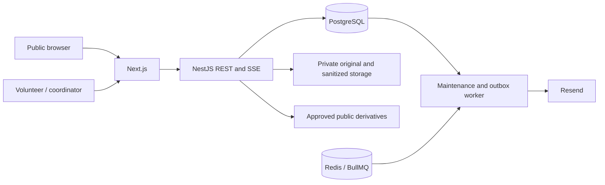

# Architecture

Saathi has one authoritative public origin. Public content is deliberately projected into narrow response contracts; internal IDs and donor contact data do not cross those contracts. PostgreSQL owns durable requests, commitments, deliveries, sessions, revisions, media records, notification outbox, and append-only audit events.

## Quantity semantics

`requestedQuantity` is the target. `committedQuantity` includes reserved, ordered, confirmed, in-transit and delivered goods. `receivedQuantity` counts actual delivery records. Open availability is `requestedQuantity - committedQuantity`; undelivered quantity is `requestedQuantity - receivedQuantity`. Closing a request makes public availability zero without rewriting historical quantities.

A request-row lock serializes reservation, expiry, cancellation, edits and receipt. Under READ COMMITTED the transaction reads the fresh counters after taking the lock. Database CHECK constraints require `0 <= received <= committed <= requested`. No transaction depends on Redis for allocation correctness.

Every donation write requires a UUID idempotency key. A transaction advisory lock derived from scope/key is held before checking or writing the durable idempotency response. A duplicate request with the same body returns the same result; changed input returns 409. Request versions reject stale edits and receipt confirmations. Client retry keys survive recoverable errors and change when the submitted action changes.

Requests move from OPEN to partial/full commitment, CONFIRMED or IN_TRANSIT when the covered orders progress, PARTIALLY_RECEIVED, and COMPLETED. CANCELLED, EXPIRED and COMPLETED are terminal; later receipts for valid outstanding orders are recorded without reopening them. Completed/cancelled requests cannot be deleted at the database layer. Receipt transactions create audit events and notifications together. A provider failure cannot undo delivery.

## Services

Controllers validate and delegate. AuthService authenticates database sessions and checks verified memberships. RequestsService handles request/revision and post publication. DonationsService owns reservation/expiry and delivery transitions. ManagementService handles organization and volunteer administration and moderation. MediaService owns file inspection, scanning and sanitized derivatives. S3Storage implements the storage provider contract, with a separate development filesystem mode. Jobs provides BullMQ scheduling plus a database maintenance fallback.

Text-only posts by approved volunteers can publish immediately. Media posts require coordinator approval. Linked posts and supply requests publish in the same database transaction. Asset publication requires storage I/O; it is fail-closed for public feed inclusion, but storage/database operations cannot share a transaction. Reconciliation and stricter object-store access controls are described in the threat model.

## Offline work and nearby preview

The PWA preserves its secure-origin shell and selected public snapshots separately from private IndexedDB work. Approved volunteers prepare nonextractable signing keys while connected. Original-author envelopes persist before transmission; nearby sessions carry eligible public events without changing their author. Internet carriers opt in, and SyncService validates current authorization, signatures, expiration and optimistic versions before applying canonical domain changes. Durable event records and server-signed receipts prevent duplicate publication and distinguish acceptance from visibility.

The browser preview uses local WebRTC with complete manual invitation/reply signaling and matching-code confirmation. Live calls and private conversations remain separate from public relief forwarding. Attachment chunks persist and resume after re-pairing. Private field originals upload through the author's authenticated media flow; carriers do not upload those bytes. Native discovery/radio/hub adapters require measured physical proofs before implementation. See `nearby-connectivity-architecture.md` and `offline-protocol.md` for transport boundaries and limits.

## Availability and scaling

SSE emits public revision signals every five seconds. Clients refetch authoritative state and also poll every 30 seconds. Expiry is lazy on reservation as well as periodic. Notification claims use row locks; Resend receives a durable idempotency key. Local logging never pretends to send an email.

Current lists are bounded to 100 requests and 50 posts. Large deployments should add cursor pagination, consolidate SSE revision polling, isolate media jobs, and enforce distributed per-client rate limits at the trusted ingress. No load-test capacity claim has been made. Health checks test process liveness; readiness tests PostgreSQL. Admin-authenticated metrics report request, donation, expiry, outbox and processing counts.
